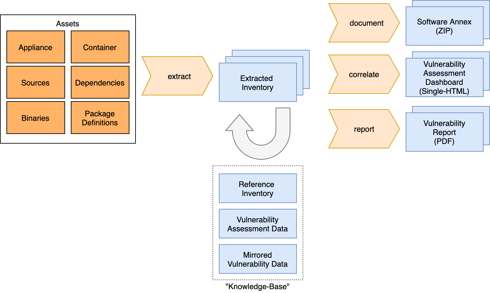

# metaeffekt-documentation-template

## Overview

## Current Scope

- illustrate extraction from containers
- illustrate extraction from a POM
- include configuration for creating local vulnerability mirror
- generate vulnerability dashboard based on the extracted inventories
- generate a software distribution annex containing a bill of materials
- generate a vulnerability report including assessment data.

## Future Scope

- illustrate extraction from NodeJS
- illustrate local source scan for licenses
- generate CycloneDx BOM from inventories
- ingest DependencyTrack results

## Build Instructions

Mirror the vulnerability databases once using the `mirror-database` profile:

    mvn clean install -Pmirror-database

This may take around 10 minutes. The process will create a local mirror of public vulnerability data in the `.database`
folder. Rerun the process to update the data regularly.

Run the extraction and advisories/documents generation using the `extract,advise,document` profiles:

    mvn clean install -Pextract,advise,document,report

The profiles extract, advise, document and report have been split using profiles to be used separately from the command
line.
Profile `extract` is a prerequisite to `advise` and `document`.
Profile `advise` is prerequisite for `report`.

With container enabled (currently disabled):

    mvn clean install -Pextract,document -Dimage.repo=debian -Dimage.tag=latest

The container enabled process requires that docker daemon is running and the container of interest was already pulled.

## DISCLAIMER

Currently, the provided inventory does only contain minimal information. We promise to add more data to better
illustrate the use cases.
