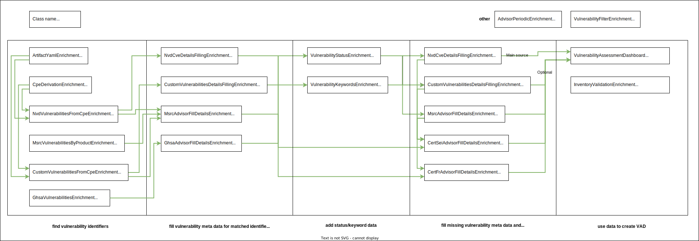

> [Vulnerability Monitoring](../inventory-enrichment-overview.md) > [Inventory Enrichment](inventory-enrichment.md) >
> Inventory Enrichment Steps

# Inventory Enrichment Steps

For examples and more information on how to implement an inventory enrichment pipeline yourself, see these documents:

- [Java process](java.md)
- [Maven POM](maven.md)

As some steps require other steps to be run before them, there is a certain default order the following steps should be
executed in:

- **[Step 1](#step-1---find-vulnerability-identifiers)**: find vulnerability identifiers
    - [`artifactYamlEnrichment`](#artifact-correlation-yaml)
    - [`cpeDerivationEnrichment`](#cpe-derivation)
    - [`msVulnerabilitiesByProductEnrichment`](#msrc-vulnerabilities-from-ms-products)
    - [`nvdMatchCveFromCpeEnrichment`](#nvd-cve-from-cpe)
    - [`customVulnerabilitiesFromCpeEnrichment`](#custom-vulnerabilities-from-cpe)

- **[Step 2](#step-2---fill-vulnerability-meta-data-for-matched-identifiers)**: fill vulnerability meta data for matched
  identifiers
    - [`nvdCveFillDetailsEnrichment`](#nvd-cve-details-filling)
    - [`customVulnerabilitiesFillDetailsEnrichment`](#custom-vulnerability-details-filling)
    - [`msrcAdvisorFillDetailsEnrichment`](#msrc-advisor-details-filling)

- **[Step 3](#step-3---add-statuskeyword-data)**: add status/keyword data
    - [`vulnerabilityStatusEnrichment`](#vulnerability-status)
    - [`vulnerabilityKeywordsEnrichment`](#vulnerability-keywords)

- **[Step 4](#step-4---fill-vulnerability-meta-data-and-add-advisory-data-if-available)**: fill vulnerability meta data
  and add advisory data if available
    - [`nvdCveFillDetailsEnrichment`](#nvd-cve-details-filling)
    - [`customVulnerabilitiesFillDetailsEnrichment`](#custom-vulnerability-details-filling)
    - [`msrcAdvisorFillDetailsEnrichment`](#msrc-advisor-details-filling)
    - [`certFrAdvisorEnrichment`](#cert-fr-advisors-details-filling)
    - [`certSeiAdvisorEnrichment`](#cert-sei-advisors-details-filling)

- **[Step 5](#step-5---use-data-to-create-vad)**: adjust view and use data to create VAD
    - [`vulnerabilityFilterEnrichment`](#vulnerability-filter)
    - [`vulnerabilityAssessmentDashboardEnrichment`](#vulnerability-assessment-dashboard-vad)

- **[Other](#other-steps)**: steps that do not belong into the main enrichment process
    - [`advisorPeriodicEnrichment`](#advisor-periodic)

Open the following image in a new tab to see more details about the requirements between the different steps:



Check out the [data source dependants](../inventory-enrichment-overview.md#overview-graphs) to learn what download/index
structures you need to use the individual steps.

The titles for the individual steps below are build from: `Step Name → Class Name / Maven POM config parameter`.

# Step 1 - find vulnerability identifiers

## Artifact Correlation YAML

→ `ArtifactYamlEnrichment` / `artifactYamlEnrichment`

This step is mainly used to perform the first manual step of the vulnerability assessment process. It allows for
overwriting the findings from the following automatic steps by appending and subtracting information from any field on
artifacts in an inventory.

It uses YAML files in the [Artifact Correlation YAML format](example-data/artifact-data.json) to find matching artifacts
and append some data to them. See [Vulnerability Assessment (Correlation)](artifact-correlation.md) for more details on
how-to and to see our philosophy.

An example for how we do this:  
A file consists of a list of entries, each one having a header comment block in front of it with the original artifact
attributes and a reason, why this correlation has been picked. After that: the actual entry with at least an `affects`
and an `append`/`remove` section. In all sections, artifact attributes can be listed.

```yaml
# Id:               org.eclipse.jetty.continuation_9.4.18.v20190429.jar
# Component:        Eclipse Jetty Continuation
# Version:          9.4.18.v20190429
# Derived CPE URIs: cpe:/a:eclipse:jetty, cpe:/a:jetty:jetty
# reason:           cpe:/a:jetty:jetty --> Additional Jetty repositories not covered by the Eclipse Foundation IP policy
#                   cpe:/a:mortbay:jetty --> https://en.wikipedia.org/wiki/Jetty_(web_server)#History
#                   cpe:/a:mortbay_jetty:jetty --> https://en.wikipedia.org/wiki/Jetty_(web_server)#History
- affects:
    - Component: Eclipse Jetty*
    - Id: jetty*.jar
  ignores:
    Id: jetty-server*.jar
  append:
    Inapplicable CPE URIs: cpe:/a:jetty:jetty_http_server
    Additional CPE URIs: cpe:/a:eclipse:jetty, cpe:/a:mortbay:jetty, cpe:/a:mortbay_jetty:jetty, cpe:/a:jetty:jetty
```

### Technical description:

For each YAML file specified:

1. Parse all `YamlDataEntry` from the file.
2. For each entry:
    1. Find the artifacts affected by the entry by using `YamlDataEntry#affects()`
    2. Apply the entry to the artifact by appending/setting values in or removing fields by using
       `YamlDataEntry#apply()`

### Configuration Parameters

- `List<File> yamlFiles = new ArrayList<>()`  
  files or entire directories that are recursively scanned for YAML files conforming to the
  [Artifact YAML Data schema](example-data/artifact-data.json) that are then applied to the artifacts in the inventory.

### Affected attributes

- `Artifact Inventory`
    - read/write :mag_right: :memo:
        - any attribute

## CPE Derivation

→ `CpeDerivationEnrichment` / `cpeDerivationEnrichment`

CPE URIs are vendor-product pairs that apply to single (or sometimes to multiple) components. They allow to match
vulnerabilities in the next step. In order to derive them from each artifact, the above attributes are used to search
for vendors/products. This step may produce false positives and negatives, since missing/incomplete information or
commonly used terms like `core` can lead to the CPEs not being found or too many being matched. These CPEs are then
appended to the `Derived CPE URIs` of the artifacts.

Example:

- Artifact with Id=`gdk-pixbuf2-2.36.12`, Component=`gdk-pixbuf2`, Version=`2.36.12`
- derives these aliases:
  `gdk_pixbuf, gdk_pixbuf2, gdkpixbuf2, gdkpixbuf, gdk pixbuf2, gdk-pixbuf2, gdk pixbuf, gdk-pixbuf`
- finding these products → vendors: `gdk_pixbuf -> [redhat], gdkpixbuf -> [gnome], gdk-pixbuf -> [gnome]`
- which maps to these CPEs: `cpe:/a:gnome:gdk-pixbuf, cpe:/a:gnome:gdkpixbuf, cpe:/a:redhat:gdk_pixbuf`

As mentioned above, this usually introduces a lot of false-positives into the project. Use the
[Artifact Correlation YAML](#artifact-correlation-yaml) step to correct these findings.

### Configuration Parameters

- `int maxCorrelatedCpePerArtifact = Integer.MAX_VALUE`  
  The maximum amount of CPEs that are allowed to be matched per artifact, additional CPEs will be dropped. To guarantee
  consistency over runs, the list of CPE is sorted alphabetically before removing elements.

### Affected attributes

- `Artifact Inventory`
    - read :mag_right:
        - Component
        - Group Id
        - Id
        - Organization
        - PURL
        - DT PURL Findings
    - write :memo:
        - Derived CPE URIs

### Technical description

1. For each field listed below, derive aliases by replacing certain character sequences with others and splitting
   identifiers. These are collected in a set.
    1. Id
    2. Component
    3. Group Id
    4. Artifact Id
    5. Organization
2. Use the `NvdCpeApiVendorProductIndexQuery` to find vendor/product pairs to the aliases. There are multiple fallback
   methods if the previous one did not find any vendor/product pairs:
    1. Search the list of products for the alias, if found add all vendors with the product to the list.
       Search the list of vendors for the alias, if found add all products with the vendor to the list.
    2. Iterate over all product/vendor pairs, add all that fulfill these conditions for both: are not in
       the unspecificProducts set AND when trimmed from underscores equal at least one alias.
    3. Perform a fuzzy index search for the vendor/product. Add all vendor/products found.
3. Iterate the vendor/product pairs and find all matching CPEs using the `NvdCpeApiIndexQuery` with these pairs. Remove
   every part behind the product from the CPE, as the version cannot be inferred by this step. The result of this is a
   set of CPEs of the form: `cpe:/[part]:[vendor]:[product]`
4. Sort the CPEs alphabetically
5. Limit the CPEs to `maxCorrelatedCpePerArtifact`
6. Store the CPEs in `2.2` format (or `2.3` as fallback) in `Derived CPE URIs`

## MSRC Vulnerabilities from MS Products

→ `MsrcVulnerabilitiesByProductEnrichment` / `msVulnerabilitiesByProductEnrichment`

In order to find Microsoft-related vulnerability information, the [MSRC data](../msrc/understanding-data.md) can be
used. A large amount of preparation work has already been performed by the download and index, so finding affected
vulnerabilities will be a relatively simple task.

All artifacts with a `MS Product ID` are iterated over:

1. If the `MS Product ID` is not already an Id, search the `MsrcProductIndexQuery` for product Ids by name
2. Find all `MS Knowledge Base ID`, which represent the [updates](https://www.catalog.update.microsoft.com/Home.aspx)
   that have already been performed on the system
3. Collect a list of potential vulnerabilities:
    1. Use the `MsrcAdvisorIndexQuery` to find advisors that list the product Id as affected
    2. Use the `MsrcKbChainIndexQuery` to find KB nodes and their vulnerabilities that list the product Id as affected.
       If you wish to learn more about this step, see [understanding MSRC data](../msrc/understanding-data.md).
4. Check whether the vulnerability has been fixed directly or indirectly via supersedence using the
   `MsrcKbChainIndexQuery`. Move the vulnerability to a different list, if it is fixed.
5. Append all active vulnerabilities to `Vulnerability` artifact attribute and all fixed to `Vulnerability fixed by KB`
   for documentation purposes
6. Append all active vulnerabilities (names) to the `Vulnerability` sheet, if not already present

### Configuration Parameters

none

### Affected attributes

- `Artifact Inventory`
    - read :mag_right:
        - MS Product ID
        - MS Knowledge Base ID
    - write :memo:
        - Vulnerability
        - Vulnerability fixed by KB
- `Vulnerabilities`
    - write :memo:
        - Name

## NVD CVE from CPE

→ `NvdVulnerabilitiesFromCpeEnrichment` / `nvdMatchCveFromCpeEnrichment`

This step uses the CPE data from the previous steps in order to collect matching vulnerabilities (CVE).

Iterate over all artifacts in the inventory:

1. Parse the [effective CPEs](parsing-effective-cpe.md#effective-cpe) from the artifact
2. For each CPE:
    1. Build a _query version_ (Version/Update) by combining the artifact and CPE versions:  
       Version: CPE version if not (`*`); use artifact version as fallback  
       Update: CPE update if both (version and update) are not (`*`); use `null` as fallback
    2. Use the _query version_ to build a _CPE_ with
        - vendor = vendor from the CPE
        - product = product from the CPE
        - version/update = _query version_ version/update
    3. Use the CPE to find affected vulnerabilities using the
       `NvdCveIndexQuery#findVulnerabilitiesByFlatAffectedConfiguration` method. This is quite the complicated step,
       that I should describe somewhere here in the future. Check out the source code if you are interested in the
       meantime.
    4. Limit vulnerabilities to `maxCorrelatedCvePerArtifact`
    5. Remove the `Vulnerability fixed by KB` from the [MSRC step](#msrc-vulnerabilities-from-ms-products) above
    6. Remove the `Inapplicable CVE`
    7. Add the `Addon CVEs`
    8. Append the collected CVE to the artifact `Vulnerability` field
    9. Collect the CPEs that matched vulnerabilities into Matched CPEs
3. Append all collected vulnerabilities (names) to `Vulnerabilities` sheet of the inventory if not already present

### Configuration Parameters

- `int maxCorrelatedVulnerabilitiesPerArtifact = Integer.MAX_VALUE`  
  The maximum amount of vulnerabilities that are allowed to be matched per artifact. Additional vulnerabilities will be
  dropped. To guarantee consistency over runs, the list is sorted alphabetically before removing the vulnerabilities.

### Affected attributes

- `Artifact Inventory`
    - read :mag_right:
        - CPE URIs
        - Derived CPE URIs
        - Additional CPE URIs
        - Inapplicable CPE URIs
        - Version
        - Addon CVEs
        - Inapplicable CVE
        - Vulnerability
        - Vulnerability fixed by KB
    - write :memo:
        - Vulnerability
- `Vulnerabilities`
    - write :memo:
        - Name
        - Product URIs

## Custom Vulnerabilities from CPE

→ `CustomVulnerabilitiesFromCpeEnrichment` / `customVulnerabilitiesFromCpeEnrichment`

All `X from CPE` enrichment steps use the exact same matching logic, so the process for this is the same as the
[NVD CVE from CPE](#nvd-cve-from-cpe) above.

However, this is not a regular data source: This source uses custom vulnerabilities specified in either YAML or JSON
files somewhere on your file system. See [Custom Vulnerabilities](custom-vulnerabilities.md) for more detail.

# Step 2 - fill vulnerability meta data for matched identifiers

The "vulnerability filling" steps all work on a similar basis. Since the previous steps only supplied vulnerability
_names_ without any details like CVSS, description, URLs, ..., these details have to be filled now, before other steps
can use this data.

All detail filling steps provide two methods:

- `shouldMissingInformationBeFilled(vulnerability)`: tells the process to fill details on a vulnerability or skip it.
  This is usually decided by checking whether there is no description or URL yet if the name matches a certain pattern
  or whether an advisory with the given source is present.
- `fillDetailsOnVulnerability(vulnerability)`: the actual method that fills the details. This is different from step to
  step, but it usually involves adding a description, URL, references, CVSS data, advisor data and more.

The reason for this seemingly unnecessary split between finding vulnerability and filling their vulnerability data is
that this allows an arbitrary number of enrichment steps to find vulnerability identifiers on artifacts before and then
only have one step that fills all the vulnerability information. As they skip already processed entries, they can be
used multiple times without repeating the process multiple times on the same vulnerabilities.

If you look at the list above, you will notice that some of these steps appear multiple times. Whenever new
vulnerabilities are introduced to the inventory, their details have to be filled again. Seeing as the status and keyword
enrichment can add new vulnerabilities, but require vulnerability information themselves, the enrichment steps have to
be performed after those.

## NVD CVE details filling

→ `NvdCveDetailsFillingEnrichment` / `nvdCveFillDetailsEnrichment`

For every vulnerability that misses detailed information, append the generally available NVD CVE information. This
includes NVD URL, description, CWE, source, CVSS scores and references.

For all `VulnerabilityMetaData` that have a CVE-identifier and are missing both `Description` and `Url`:

1. Find the vulnerability in the NVD database
2. Create the `Url` from `https://nvd.nist.gov/vuln/detail/ + name`
3. Join the CWE as a CSV string into `Weaknesses`
4. Join the vulnerability sources as a CSV string into `Source`
5. Apply the CVSS information as non-modified vectors
6. Join the references as JSONArray into `References`
7. Add the description into `Description`

### Configuration Parameters

- `String cvssSeverityRanges = CvssSeverityRanges.CVSS_3_SEVERITY_RANGES.toString()`  
  a string conforming to the [CVSS Severity Ranges format](#default-cvss-ranges).

### Affected attributes

- `Vulnerabilities`
    - read :mag_right:
        - Name
    - write :memo:
        - Description
        - Url
        - Weaknesses
        - Source
        - References
        - (Multiple CVSS-scoring related fields)

## Custom Vulnerability details filling

→ `CustomVulnerabilitiesDetailsFillingEnrichment` / `customVulnerabilitiesFillDetailsEnrichment`

This process works the same and affects the same attributes as `NVD CVE details filling` above, except the `Url` might
be a custom URL.

### Configuration Parameters

- `String cvssSeverityRanges = CvssSeverityRanges.CVSS_3_SEVERITY_RANGES.toString()`  
  a string conforming to the [CVSS Severity Ranges format](#default-cvss-ranges).
- `List<File> vulnerabilityFiles = new ArrayList<>()`  
  a list of files/directories of files that are parsed recursively conforming to the
  [Custom Vulnerability format](custom-vulnerabilities.md).

### Affected attributes

See `NVD CVE details filling`.

# Step 3 - add status/keyword data

## Vulnerability Status

→ `VulnerabilityStatusEnrichment` / `vulnerabilityStatusEnrichment`

See [Vulnerability Status](vulnerability-status.md) to learn more about vulnerability status files.

Adds status information to the vulnerabilities in the inventory.

1. Parse all status files provided by the configuration parameter `yamlFiles`
2. Append all vulnerabilities that are not yet known to the inventory to the `Vulnerabilities` sheet as status `void`
   with the current timestamp and appends a `Tags` value `added by status`
3. Use the [CPE URIs](parsing-effective-cpe.md) and the vulnerability name to find affected `VulnerabilityStatus`
   entries
4. Apply the first matching entry. If there is at least one more matching, warn the user.

### Configuration Parameters

- `String cvssSeverityRanges = CvssSeverityRanges.CVSS_3_SEVERITY_RANGES.toString()`  
  a string conforming to the [CVSS Severity Ranges format](#default-cvss-ranges).
- `List<File> statusFiles = new ArrayList<>()`  
  a list of files/directories of files that are parsed recursively conforming to the
  [Vulnerability Status format](vulnerability-status.md).
- `String[] activeLabels = new String[]{}`  
  Labels that are marked as active. Can be used to enable or disable certain status assessments from the `statusFiles`.

### Affected attributes

- `Vulnerabilities`
    - read :mag_right:
        - Name
    - write :memo:
        - Reviewed Advisories
        - Status history
        - Accepted by
        - Reported by
        - Title
        - (Multiple CVSS-scoring related fields)
        - Status
        - Rationale
        - Risk
        - Measures

## Vulnerability Keywords

→ `VulnerabilityKeywordsEnrichment` / `vulnerabilityKeywordsEnrichment`

See [Vulnerability Keywords](vulnerability-keywords.md) to learn more about vulnerability keyword files.

1. Parse all keyword sets from the `yamlFiles` configuration parameter
2. Iterate over all vulnerabilities from the inventory:
    1. Find the matching keyword sets using the `Description` and `Weakness` from the vulnerability (case-insensitive
       search)
    2. Write the keyword information into the `Matched Keyword Sets` attribute. The data is stored in a json array and
       may contain score, name, category and notes.
    3. If at least one keyword set has a score, write the total score into `Matched Keyword Total Score`
    4. A keyword file may reference a status entry. If this is the case, apply the status to the matching vulnerability.
       See the `vulnerabilityStatusEnrichment` above for more details.

### Configuration Parameters

- `String cvssSeverityRanges = CvssSeverityRanges.CVSS_3_SEVERITY_RANGES.toString()`  
  a string conforming to the [CVSS Severity Ranges format](#default-cvss-ranges).
- `List<File> statusFiles = new ArrayList<>()`  
  a list of files/directories of files that are parsed recursively conforming to the
  [Vulnerability Keyword format](vulnerability-keywords.md).
- `List<String> activeLabels = new ArrayList<>()`  
  Labels that are marked as active. Can be used to enable or disable certain status assessments from the `statusFiles`.

### Affected attributes

- `Vulnerabilities`
    - read :mag_right:
        - Description
        - Weakness
        - Title
        - Advisories
    - write :memo:
        - Matched Keyword Sets
        - Matched Keyword Total Score
        - (… all Vulnerability Status attributes)

# Step 4 - fill vulnerability meta data and add advisory data if available

Optionally, advisory information can be appended to the inventory. This currently includes data from the CERT-FR,
CERT-SEI and MSRC (Microsoft Security Response Center). These enrichment steps all work similarly, as they all inherit
from the `VulnerabilityDetailsFillingEnrichment` class, which is also the basis for the _Step 2_ enrichment steps.

1. For every vulnerability, check whether `shouldMissingInformationBeFilled` is true. For the steps below, this is
   always if the `Advisories`attributes do not contain and advisory entry of the given type
   (`MSRC`, `CERT_FR`, `CERT_SEI`), as this would mean that the process has already run on the vulnerability.
2. If an enrichment is required, call the `fillDetailsOnVulnerability` method.
3. Collect all advisor entries with either the `Name` of the vulnerability as id, or as fallback, all entries that
   reference the current vulnerability `Name` in the referenced ids.
4. Use the `appendToVulnerabilityMetaData` method to apply the entry to the vulnerability:
    1. Use the `toJson` method of the advisory entry to merge existing advisor entries with the new one in `Advisories`
    2. If the vulnerability is missing `Url` or `Description`, fill the data
    3. Merge the references with any existing `References`

## MSRC Advisor details filling

→ `MsrcAdvisorFillDetailsEnrichment` / `msrcAdvisorFillDetailsEnrichment`

This step uses the general step (Step 4) from above.

Adds MSRC Advisor information to the vulnerabilities in the inventory. This is done by finding all CVE/ADV
vulnerabilities that have not been processed by this process yet and using these names to match advisories from the MSRC
index.

Collect all `VulnerabilityMetaData` with a `CVE` or `ADV` identifier, but without matched MSRC advisory.

1. Find all advisories that contain the CVE/ADV from the vulnerability as id
2. Append the advisor source to the `Source` field
3. If no `Url` present, set it to the advisor URL
4. If no `Description` present, set it to the summary or description as fallback
5. Append the Advisor URL and all other references to the `References` field
6. If present, apply the CVSS information as modified information
7. Use the `toJson` method to append the entire advisory entry in `Advisories`. This includes data like descriptions,
   modified date, references and more. This data can then be used in later steps.

### Configuration Parameters

- `String cvssSeverityRanges = CvssSeverityRanges.CVSS_3_SEVERITY_RANGES.toString()`  
  a string conforming to the [CVSS Severity Ranges format](#default-cvss-ranges).

### Affected attributes

See `NVD CVE details filling`.

## CERT-FR Advisors details filling

→ `CertFrAdvisorFillDetailsEnrichment` / `certFrAdvisorEnrichment`

This step uses the general step (Step 4) from above.

### Configuration Parameters

- `String cvssSeverityRanges = CvssSeverityRanges.CVSS_3_SEVERITY_RANGES.toString()`  
  a string conforming to the [CVSS Severity Ranges format](#default-cvss-ranges).

### Affected attributes

See `NVD CVE details filling`.

## CERT-SEI Advisors details filling

→ `CertSeiAdvisorFillDetailsEnrichment` / `certSeiAdvisorEnrichment`

This step uses the general step (Step 4) from above.

### Configuration Parameters

- `String cvssSeverityRanges = CvssSeverityRanges.CVSS_3_SEVERITY_RANGES.toString()`  
  a string conforming to the [CVSS Severity Ranges format](#default-cvss-ranges).

- `File svgDirectory`

### Affected attributes

See `NVD CVE details filling`.

# Step 5 - use data to create VAD

## Vulnerability Filter

→ `VulnerabilityFilterEnrichment` / `vulnerabilityFilterEnrichment`

Allows for filtering vulnerabilities based on their name, dates, scores, etc. The filter is applied to every
vulnerability in the inventory and only those that match the filter are kept. It is highly recommended to see the
[Vulnerability Filter format](vulnerability-filter-format.md) document for more information on how to build a filter
expression.

If no filter is provided, this enrichment step is skipped and all vulnerabilities are kept.

### Configuration Parameters

- `String vulnerabilityIncludeFilter = ""`  
  A filter string conforming to the [Vulnerability Filter format](vulnerability-filter-format.md) that is used to filter
  vulnerabilities based on a variety of criteria. If no filter is provided, all vulnerabilities are included.

### Affected attributes

- `Vulnerabilities`
    - read :mag_right:
        - Description
        - Weakness
        - Last Updated Timestamp
        - Created Timestamp
        - Source
        - (Multiple CVSS-scoring related fields)

## Vulnerability Assessment Dashboard (VAD)

→ `VulnerabilityAssessmentDashboard` / `vulnerabilityAssessmentDashboardEnrichment`

The Vulnerability Assessment Dashboard is one of the resulting documents that results from the Inventory Enrichment
Pipeline. It is a single-page HTML document that contains a summary of all vulnerabilities, their metadata and
references. It allows for sorting and filtering the information contained within.

Even after several performance updates to one of the core features, the vulnerability timeline, the generation of the
dashboard can still take quite a long time if many unreviewed vulnerabilities are present in the inventory.  
You may want to consider setting the `vulnerabilityTimelinesGlobalEnabled` configuration parameter to `false` in case
this information is not yet required. You could also set the `maximumTimeSpentPerTimeline` configuration parameter to a
value like `120` (seconds) to limit the time spent on generating the timelines.

### Configuration Parameters

- `String cvssSeverityRanges = CvssSeverityRanges.CVSS_3_SEVERITY_RANGES.toString()`  
  a string conforming to the [CVSS Severity Ranges format](#default-cvss-ranges).
- **DEPRECATED:** `double minimumVulnerabilityIncludeScore = Double.MIN_VALUE`  
  The minimum score vulnerabilities need to be included in the VAD. Use `vulnerabilityIncludeFilter` instead.
- `String vulnerabilityIncludeFilter = ""`  
  See [Vulnerability Filter](#vulnerability-filter) for more details. A filter string conforming to the
  [Vulnerability Filter format](vulnerability-filter-format.md) that is used to filter vulnerabilities based on a
  variety of criteria.
- `int maximumVulnerabilitiesPerDashboardCount = Integer.MAX_VALUE`  
  The absolute maximum amount of vulnerabilities to include in the VAD.
- `int maximumCpeForTimelinesPerVulnerability = Integer.MAX_VALUE`  
  How many timelines should be generated per vulnerability, if enough matching CPE are present. Setting this to a lower
  value like `3` is recommended when the inventory is still fresh with missing correlation files to prevent false
  positives from taking a long time to generate.
- `int maximumVulnerabilitiesPerTimeline = 72260`  
  The maximum amount of vulnerabilities to query for whilst generating the timelines. The limit is set to prevent CPEs
  with a long history from taking too long to generate.
- `int maximumVersionsPerTimeline = Integer.MAX_VALUE`  
  The maximum amount of versions to include in the timelines. If set to a lower value than the amount of versions
  matched, the versions will be cropped from the left (i.e. the older, lower versions). It is not guaranteed that this
  exact amount of versions is hit, as the normalizing process that follows after that might reduce the amount further.
- `int maximumTimeSpentOnTimelines = Integer.MAX_VALUE`  
  The global maximum amount of _SECONDS_ the process should spend generating all timelines. If hit, will stop searching
  for more versions and vulnerabilities.
- `int maximumTimeSpentPerTimeline = Integer.MAX_VALUE`  
  The maximum amount of _SECONDS_ the process should spend generating a single timeline. If hit, will stop searching for
  more versions and vulnerabilities.
- `double insignificantThreshold = Integer.MIN_VALUE`  
  If a vulnerability has a score of `insignificantThreshold` or less, it will be marked as `insignificant` if it has no
  other status. A recommended value for this is `7`.
- `boolean vulnerabilityTimelinesGlobalEnabled = true`  
  Whether to generate timelines at all.
- `boolean vulnerabilityTimelineHideIrrelevantVersions = true`  
  Whether to include all versions in the timeline or to filter them for 'relevant' versions (with a change in the
  vulnerability count, containing the current vulnerability, major version changes, ...).
- `boolean failOnVulnerabilityWithoutSpecifiedRisk = true`  
  Whether to fail after generating and writing the VAD if a vulnerability is found that does not contain a status with a
  specified `risk`.
- `boolean failOnUnreviewedAdvisories = true`  
  Whether to fail after generating and writing the VAD if a vulnerability is found that has an advisory that is not
  marked as reviewed by a status entry.

# Other steps

## Advisor Periodic

→ `AdvisorPeriodicEnrichment` / `advisorPeriodicEnrichment`

TODO

# Other information

### Default CVSS Ranges

The default CVSS severity range is the CVSS V3 range:

    None:pastel-gray:0.0:0.0,Low:strong-yellow:0.1:3.9,Medium:strong-light-orange:4.0:6.9,High:strong-dark-orange:7.0:8.9,Critical:strong-red:9.0:10.0

Apart from that, there is also the CVSS V2 range:

    Low:strong-yellow:0.0:3.9,Medium:strong-light-orange:4.0:6.9,High:strong-red:7.0:10.0

These can be found in `com.metaeffekt.artifact.analysis.vulnerability.enrichment.cvss.CvssSeverityRanges`. Or create a
custom range that uses the colors from the `DefaultColorScheme`.
