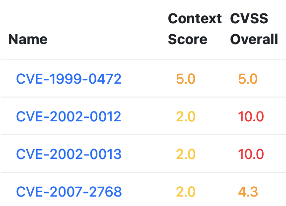

> [Vulnerability Monitoring](../inventory-enrichment-overview.md) > [Inventory Enrichment](inventory-enrichment.md) >
> Vulnerability Keywords

# Vulnerability Keywords

This document explains how to create keyword files that can be applied to an inventory using the
[`vulnerabilityKeywordsEnrichment` enrichment step](steps.md).

* [Matching criteria](#matching-criteria)
* [Tokenizer](#tokenizer)
* [Keyword files](#keyword-files)
* [Example](#example)

Keywords are used to automatically apply assessment information to many vulnerabilities at once. This is useful for an
initial prioritization of vulnerabilities. These keywords are applied to the `Description` and `Weakness` (CWE)
attributes of a vulnerability.

All YAML keywords files must follow the [Vulnerability Keywords format](example-data/vulnerability-keywords.json).

## Matching criteria

A keyword set contains multiple different keyword matching categories:

- `none`
  a list of keywords that may not appear in the reference text
- `all`
  a list of keywords that must all be present in the reference text
- `min`
  a map of keywords and a min amount count, how many of the keywords must appear in the reference text
- `max`
  a map of keywords and a max amount count, how many of the keywords may appear in the reference text

Example:

```yaml
# in order for this keyword set to become active:

all: # all of the keywords must match
  - Windows Defender
  - Microsoft

none: # none of the keywords may match
  - Windows NT

min:
  - amount: 1 # at least one of the keywords must match
    keywords:
      - Log4j
      - JNDI
  - amount: 2 # at least two of the keywords must match
    keywords:
      - Drag and Drop
      - path traversal
      - arbitrary
```

## Tokenizer

The first implementation of the Vulnerability Keywords system used a basic 'contains, ignore case' check for each of the
keywords entries. This lead to some false positives, e.g. the keyword `rsa` would match inside `adversary`.

The new implementation uses the `StringTokenizer` from Apache Text with a custom `StringMatcher` delimiter that splits
the input text and all keywords into a list of tokens, after changing the case of all characters to lowercase.

An example:

    A vulnerability was found in Drag and Drop Multiple File Upload Contact Form. 
    Affected is an unknown function of the file 'admin-ajax.php'. 
    The manipulation of the argument upload_name leads to relative path traversal.

    [ a, vulnerability, was, found, in, drag, and, drop, multiple, file, upload, contact,
      form, affected, is, an, unknown, function, of, the, file, admin, ajax, php, the,
      manipulation, of, the, argument, upload, name, leads, to, relative, path, traversal ]

The matching function then checks for each keyword entry, whether the parsed tokens appear in the same order inside the
reference text. Since this normalisation is applied to both the vulnerability `Description`/`Weakness` and the keywords,
the keywords will match with the reference text, if the order of tokens is the same, but will ignore case and token
separators.

Following up on the example from above:

- This would match:

      Drag and Drop --> [ drag, and, drop ] --> appears in that order

- This would not match:

      Drag and Drag --> [ drop, and, drag ] --> does not appear in text

      Drag and Drop files --> [ drag, and, drop, files ] --> misses 'multiple' from 'Drag and Drop Multiple File'

      Drag Drop and --> [ drag, drop, and ] --> does not appear in that order

## Keyword files

As mentioned above, YAML keywords files must follow the
[Vulnerability Keywords format](example-data/vulnerability-keywords.json). This format allows all keyword sets to not
only specify the `all`, `none`, `min` and `max` attributes, but also:

- `name` the name of the keyword set, will be displayed as title whenever a keyword set is referenced
- `category` a category this belongs to, will be displayed next to the title or displayed in groups by category
- `notes` a text description field with room for a reasoning behind the keywords
- `score` a score modifier that will be added to the overall CVSS score of the vulnerability. Note that this only
  affects the `Context Score` column in the inventory. See image below for example.
- `status` this attribute can contain an entire status entry, which will be applied to the vulnerability. See
  [Vulnerability Status](vulnerability-status.md) for more information.



## Example

```yaml
sets:
  - name: Log4J
    category: Remote Code Execution
    notes: Log4J is a logging framework for Java.
    score: 4
    min:
      - amount: 1
        keywords:
          - Log4j
          - JNDI
    status:
      title: Log4j Vulnerabilities
      cvssV2: E:U/RL:W/RC:UR/CDP:L/TD:M/CR:M/IR:H/AR:L
      cvssV3: E:H/RL:W/RC:C/CR:H/IR:L/AR:H/MAV:N/MAC:H/MPR:L/MUI:N/MS:X/MC:H/MI:L/MA:H
      reported:
        by: Author
        date: 2022-01-04 15:30:00
      accepted:
        by: Author
        date: 2022-01-10
      history:
        - status: applicable
          rationale: This vulnerability is applicable to our application.
          risk: "<p>`It poses` the *following risks*:
                   <ul>
                     <li>Risk number *1*</li>
                     <li>Risk number **2**</li>
                   </ul>
                 </p>"
          measures: "There `are` **these measures**: ..."
          score: 1.5
          author: Author
          date: 2022-01-14
      reviewed:
        - CERTFR-2021-ALE-022
        - VU#930724 (This CERT-SEI entry has been reviewed.)
        - id: certfr 2021 avi 953
          comment: This CERT-FR Avis has been reviewed.
```
