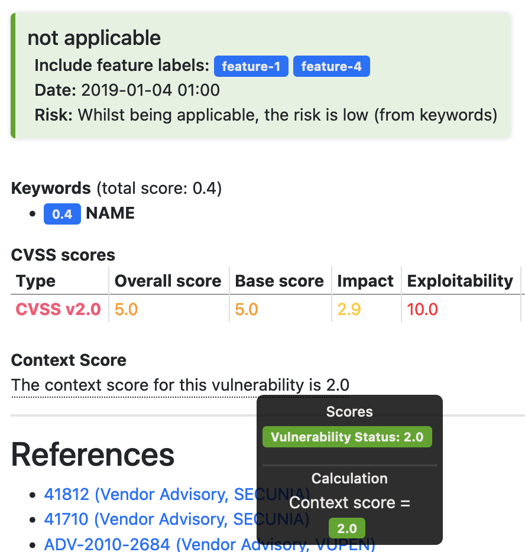

> [Vulnerability Monitoring](../inventory-enrichment-overview.md) > [Inventory Enrichment](inventory-enrichment.md) >
> Vulnerability Status

# Vulnerability Status

This document will explains how to create status files that can be applied to an inventory using the
[`vulnerabilityStatusEnrichment` enrichment step](steps.md).

Status files are used to apply assessment information to vulnerabilities in an inventory. Only one status file per
vulnerability may match: if more than one match, a random matching entry will be selected.

## Properties

Status entries each lie in a separate YAML file.

### Example

Here is a full example with all properties for such a status file:

```yaml
affects:
  cve:
    - CVE-2023-22974
  cpe:
    - cpe:/a:open-emr:openemr
  cwe:
    - CWE-552

scope: artifact
active: true

title: Path Traversal in OpenEMR

cvssV3: E:P/RL:U/RC:R/CR:H/IR:L/AR:M/MAV:A/MAC:H/MPR:L/MUI:N/MS:C/MC:L/MI:N/MA:L
# cvssV2: ...

reported:
  by: Reporter
  date: 2023-03-05

accepted:
  by: Acceptor
  date: 2023-03-06

history:
  - status: applicable
    author: Author
    date: 2023-03-07
    score: 4
    rationale: "The fix is available in version x.y.z"
    measures: "Upgrade to version x.y.z"
    risk: "Risk is low, no external exposure of the service"
    labels:
      includes:
        - module-open-emr
      excludes:
        - module-desktop-app

reviewed:
  - id: CERTFR-2023-ALE-015
    comment: "Fix is available in version x.y.z"
  - id: CERTFR-2023-ALE-015 (Fix is available in version x.y.z)
```

### Status file properties

| Property                      | Description                                                                                                                                                                                                                                                                                                                                                               |
|-------------------------------|---------------------------------------------------------------------------------------------------------------------------------------------------------------------------------------------------------------------------------------------------------------------------------------------------------------------------------------------------------------------------|
| `affects` → `cpe`/`cwe`/`cve` | Lists of `cpe`, `cwe` or vulnerability identifiers (`cve`) on which to apply this status file to.                                                                                                                                                                                                                                                                         |
| `scope`                       | Whether to apply this status file to only one `artifact` (one vulnerability), or to an entire `inventory`. If `inventory` is specified, the `affects` section is ignored and the status file is applied to every vulnerability in the inventory.<br/>This is useful when applying (environmental) cvss information to an entire inventory at once.                        |
| `active`                      | If set to `false`, the file will be ignored. Defaults to `true`.                                                                                                                                                                                                                                                                                                          |
| `title`                       | Will be displayed alongside the vulnerability identifier in the Vulnerability Assessment Dashboard (HTML) and the Vulnerability Report (PDF).                                                                                                                                                                                                                             |
| `cvssV3`/`cvssV2`             | Valid CVSS vectors that overwrite all specified components on the base vector on the vulnerability. Useful for modifying environmental and temporal information on the vector.                                                                                                                                                                                            |
| `reported`/`accepted`         | Author and date of report and acceptance.                                                                                                                                                                                                                                                                                                                                 |
| `reviewed`                    | A list of advisories matched on the vulnerability that have been reviewed. Reviewing all advisories can be set to be mandatory by setting the `failOnUnreviewedAdvisories` flag in the [Vulnerability Assessment Dashboard](steps.md#vulnerability-assessment-dashboard-vad). Reviewed advisories will be highlighted in green in the Vulnerability Assessment Dashboard. |
| `history`                     | The status history is a list of elements, that each represent a different state in the assessment process. See below for a description of all attributes.                                                                                                                                                                                                                 |

### Status history properties

| Property                         | Description                                                                                                                                                                                                                                                                                                                                                                                                                                                     |
|----------------------------------|-----------------------------------------------------------------------------------------------------------------------------------------------------------------------------------------------------------------------------------------------------------------------------------------------------------------------------------------------------------------------------------------------------------------------------------------------------------------|
| `status`                         | Either `applicable`, `not applicable`, `insignificant` or `void`. Describes the current vulnerability state.                                                                                                                                                                                                                                                                                                                                                    |
| `author`/`date`                  | Creation date and status author.                                                                                                                                                                                                                                                                                                                                                                                                                                |
| `score`                          | In contrast to the [keyword files](vulnerability-keywords.md), this fully replaces any existing context score in the Vulnerability Assessment Dashboard. Even if keywords have been matched, this will overwrite their modification.                                                                                                                                                                                                                            |
| `risk`/`rationale`/`measures`    | Text fields for describing details regarding the current status assessment.                                                                                                                                                                                                                                                                                                                                                                                     |
| `labels` → `includes`/`excludes` | Activation labels that will cause the status history entry to only match, if any of the `includes` labels and none of the `excludes` labels are set in the `activeLabels` property, when applying the file via the `vulnerabilityStatusEnrichment` and `vulnerabilityKeywordsEnrichment` enrichers. This can be used, if the vulnerability has only been fixed in certain parts of the application and the status `not applicable` should only then be applied. |

Multiple status history entries can be specified in one status file, but only the latest active entry based on the
`date` property will be set to be the effective status.

The status score fully replaces any modifications by the keywords on the context score:



