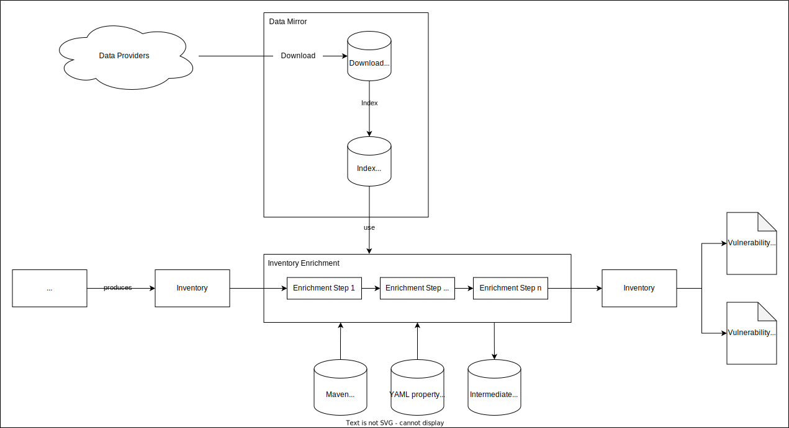

> Vulnerability Monitoring

# Vulnerability Monitoring: Inventory Enrichment

An inventory generated by one of the extrators can be processed by the inventory enrichment pipeline in order to derive
publicly available vulnerability information. This enriched inventory can then be used to generate a Vulnerability
Assessment Dashboard (single page HTML) and Vulnerability Report (PDF).

In order to reduce the amount of requests that are made during runtime to increase performance and to prevent tracing of
activities by data providers or via networks tracking, these data sources are first fully downloaded into a local
directory and then indexed into a data structure.

To improve performance and prevent tracing of activities by data providers, data sources are fully downloaded into a
local directory. Then, they are indexed into a data structure to reduce the number of requests made during runtime.

This process is split into multiple parts, that are each described in their own document:

- [**Data Sources Mirroring**](mirror/mirror-overview.md)
    - [List of individual downloads](mirror/download.md)
    - [List of individual indexes](mirror/index.md)
    - MSRC (Microsoft Security Response Center)
        - [KB-Research](msrc/understanding-data.md)
        - [Downloading the CSV files](msrc/performing-csv-download.md)
- [**Inventory Enrichment**](enrichment/inventory-enrichment.md)
    - [List of Inventory Enrichment Steps](enrichment/steps.md)
    - [Example: Maven POM](enrichment/maven.md)
    - [Example: Java process](enrichment/java.md)
    - [Inventory Enrichment process (1): Correlation step](enrichment/artifact-correlation.md)
    - [Architecture: Superclasses](enrichment/java-super-classes.md) (useful background information for understanding
      the process)
    - [Custom Vulnerability Data Sources](enrichment/custom-vulnerabilities.md)
    - [Inventory CPE data and effective CPE](enrichment/parsing-effective-cpe.md)
    - [Vulnerability Status files](enrichment/vulnerability-status.md)
    - [Vulnerability Keywords files](enrichment/vulnerability-keywords.md)

## Overview graphs

This image provides a high-level overview over the process:

This image provides a list of all classes that are involved and their dependencies/data flow. Open the image in a new
tab to see all details.

