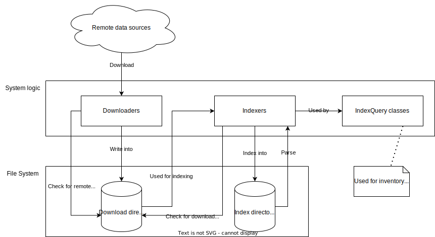

> [Vulnerability Monitoring](../inventory-enrichment-overview.md) > Mirror

# Data sources mirror overview

- [download.md](download.md)
- [index.md](index.md)

The purpose of the data mirror is to download data (JSON, XML, ...) from a variety of sources into a local directory and
create an index using Lucene Index from it. The index makes it easy to quickly search for data when it's needed during
the enrichment process.

The data is stored in a base directory, divided into two subdirectories named `download` and `index`. When initiating or
accessing a download/index, only the base directory needs to be defined as the normalized subdirectories are
automatically inferred and created.

This diagram shows the data flow in between the different Mirror phases:



Data sources include:

- [NVD](https://nvd.nist.gov/vuln)
    - Vulnerability (CVE)
    - Vendor/product (CPE)
- [CERT-FR](https://www.cert.ssi.gouv.fr/)
    - Advisories
- [CERT-SEI](https://www.sei.cmu.edu/about/divisions/cert/)
    - Advisories
- [MSRC](https://msrc.microsoft.com/update-guide/vulnerability)
    - Advisories
    - Microsoft products
    - Knowledge Base (KB/Security Updates)

## Examples

Java:

Commented out download/index classes are deprecated

```java
final String MIRROR_NVD_API_KEY = "";

// download
new CertSeiDownload(MIRROR_DIRECTORY).performDownloadIfRequired();
new CertFrDownload(MIRROR_DIRECTORY).performDownloadIfRequired();

// new NvdDownload(MIRROR_DIRECTORY).performDownloadIfRequired();
new NvdCveApiDownload(MIRROR_DIRECTORY)
        .setApiKey(MIRROR_NVD_API_KEY)
        .performDownloadIfRequired();

// new CpeDictionaryDownload(MIRROR_DIRECTORY).performDownloadIfRequired();
new NvdCpeApiDownload(MIRROR_DIRECTORY)
        .setApiKey(MIRROR_NVD_API_KEY)
        .performDownloadIfRequired();

new MsrcDownload(MIRROR_DIRECTORY).performDownloadIfRequired();
new MsrcManualCsvDownload(MIRROR_DIRECTORY).performDownloadIfRequired(); // manual download


// index
new CertSeiAdvisorIndex(MIRROR_DIRECTORY).createIndexIfRequired();
new CertFrAdvisorIndex(MIRROR_DIRECTORY).createIndexIfRequired();

// new CpeDictionaryIndex(MIRROR_DIRECTORY).createIndexIfRequired();
// new CpeDictionaryVendorProductIndex(MIRROR_DIRECTORY).createIndexIfRequired();
new NvdCpeApiIndex(MIRROR_DIRECTORY).createIndexIfRequired();
new NvdCpeApiVendorProductIndex(MIRROR_DIRECTORY).createIndexIfRequired();

// new NvdVulnerabilityIndex(MIRROR_DIRECTORY).createIndexIfRequired();
new NvdCveApiIndex(MIRROR_DIRECTORY).createIndexIfRequired();

new MsrcProductIndex(MIRROR_DIRECTORY).createIndexIfRequired();
new MsrcAdvisorIndex(MIRROR_DIRECTORY).createIndexIfRequired();
new MsrcKbChainIndex(MIRROR_DIRECTORY).createIndexIfRequired();
```

Maven:  
A full example with all configuration options can be [found here](../../../mirror/pom.xml).  
As mentioned above, a single goal is enough to create both the download and the index for all data sources. Only
mentioning a mirror phase like `<msrcDownload/>` is enough to trigger it. All of them can be found below.  
You can specify an `active` flag for any of the phases to disable the process while keeping the configuration.  
The proxy information can be specified on a global level or for each download individually.

```xml
<build>
  <!-- ... -->
  <plugins>
    <plugin>
      <groupId>com.metaeffekt.artifact.analysis</groupId>
      <artifactId>ae-mirror-plugin</artifactId>
      <version>${ae.artifact.analysis.version}</version>

      <executions>
        <execution>
          <id>data-mirror</id>
          <goals>
            <goal>data-mirror</goal>
          </goals>

          <configuration>
            <mirrorDirectory>${input.database}</mirrorDirectory>

            <proxyScheme>${proxy.scheme}</proxyScheme>
            <proxyHost>${proxy.host}</proxyHost>
            <proxyUsername>${proxy.user}</proxyUsername>
            <proxyPassword>${proxy.pass}</proxyPassword>
            <proxyPort>${proxy.port}</proxyPort>

            <!-- Downloads -->

            <certSeiDownload/>

            <certFrDownload/>

            <nvdCveDownload>
              <!-- you will need an API key in order to download the NVD data:
                   https://nvd.nist.gov/developers/request-an-api-key
                   more information: https://nvd.nist.gov/developers/start-here -->
              <apiKey>${nvd.apikey}</apiKey>
            </nvdCveDownload>

            <nvdCpeDownload>
              <!-- you will need an API key in order to download the NVD data:
                   https://nvd.nist.gov/developers/request-an-api-key
                   more information: https://nvd.nist.gov/developers/start-here -->
              <apiKey>${nvd.apikey}</apiKey>
            </nvdCpeDownload>

            <msrcDownload/>

            <msrcCsvDownload/>

            <!-- deprecated, use nvdCveDownload -->
            <nvdLegacyDownload>
              <active>false</active>
            </nvdLegacyDownload>

            <!-- deprecated, use nvdCpeDownload -->
            <cpeDictionaryDownload>
              <active>false</active>
            </cpeDictionaryDownload>

            <!-- Indexers -->

            <certSeiAdvisorIndex/>

            <certFrAdvisorIndex/>

            <nvdVulnerabilityIndex/>

            <nvdCpeIndex/>

            <nvdCpeVendorProductIndex/>

            <msrcProductIndex/>

            <msrcAdvisorIndex/>

            <msrcKbChainIndex/>

            <!-- deprecated, use nvdVulnerabilityIndex -->
            <nvdLegacyVulnerabilityIndex>
              <active>false</active>
            </nvdLegacyVulnerabilityIndex>

            <!-- deprecated, use nvdCpeIndex -->
            <cpeDictionaryIndex>
              <active>false</active>
            </cpeDictionaryIndex>

            <!-- deprecated, use nvdCpeVendorProductIndex -->
            <cpeDictionaryVendorProductIndex>
              <active>false</active>
            </cpeDictionaryVendorProductIndex>
          </configuration>
        </execution>
      </executions>
    </plugin>
  </plugins>
  <!-- ... -->
</build>
```

## Resulting directory structure

When performing a full mirror without the deprecated downloads/indexes, this directory structure is created:

- download
    - certfr
    - certsei
    - cpe-dict
    - msrc
    - msrc-csv
    - nvd
- index
    - certfr-advisors
    - certsei-advisors
    - cpe-dict
    - cpe-dict-vp
    - msrc-advisors
    - msrc-kb-chains
    - msrc-products
    - nvd-cve
