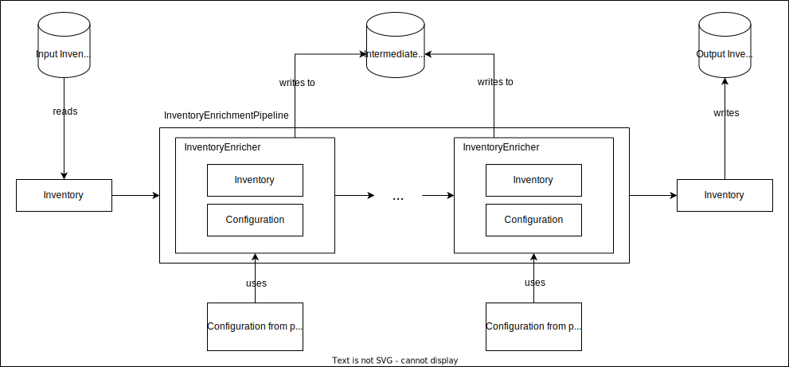

TODO: rewrite/extend and distribute this into different documents
# Data sources mirror overview

The mirroring process consists of two separate phases: downloading data from the sources and indexing that data into
various Lucene indexes.

The data is contained within a base directory, separated into two subdirectories download and index. When initializing a
download/an index, only the base directory has to be defined, all subdirectories are automatically inferred and
created.




## Perform mirror

Some downloads and indexes can require another download/index to be present, so when mirroring, this order displayed
below should be used. When using the data-mirror POM, this order is automatically applied.

A full example of a Java Program that mirrors all data sources:

```
new CertSeiDownload(MIRROR_DIRECTORY).performDownloadIfRequired();
new CertFrDownload(MIRROR_DIRECTORY).performDownloadIfRequired();
new CpeDictionaryDownload(MIRROR_DIRECTORY).performDownloadIfRequired();
new NvdDownload(MIRROR_DIRECTORY).performDownloadIfRequired();
new MsrcDownload(MIRROR_DIRECTORY).performDownloadIfRequired();

new CertSeiAdvisorIndex(MIRROR_DIRECTORY).createIndexIfRequired();
new CertFrAdvisorIndex(MIRROR_DIRECTORY).createIndexIfRequired();
new CpeDictionaryIndex(MIRROR_DIRECTORY).createIndexIfRequired();
new CpeDictionaryVendorProductIndex(MIRROR_DIRECTORY).createIndexIfRequired();
new MsrcProductIndex(MIRROR_DIRECTORY).createIndexIfRequired();
new MsrcAdvisorIndex(MIRROR_DIRECTORY).createIndexIfRequired();
new MsrcKbChainIndex(MIRROR_DIRECTORY).createIndexIfRequired();
new NvdVulnerabilityIndex(MIRROR_DIRECTORY).createIndexIfRequired();
```

A full example of a POM that mirrors all data sources:

```xml
<?xml version="1.0" encoding="UTF-8"?>
<project xmlns="http://maven.apache.org/POM/4.0.0"
         xmlns:xsi="http://www.w3.org/2001/XMLSchema-instance"
         xsi:schemaLocation="http://maven.apache.org/POM/4.0.0 http://maven.apache.org/xsd/maven-4.0.0.xsd">

    <modelVersion>4.0.0</modelVersion>

    <groupId>com.metaeffekt.test</groupId>
    <version>HEAD-SNAPSHOT</version>
    <artifactId>mirror</artifactId>

    <build>
        <plugins>
            <plugin>
                <groupId>com.metaeffekt.artifact.analysis</groupId>
                <artifactId>ae-mirror-plugin</artifactId>
                <version>HEAD-SNAPSHOT</version>

                <executions>
                    <execution>
                        <id>data-mirror</id>
                        <goals>
                            <goal>data-mirror</goal>
                        </goals>

                        <configuration>
                            <mirrorDirectory>
                                ./mirror
                            </mirrorDirectory>

                            <msrcDownload/>
                            <cpeDictionaryDownload/>
                            <certSeiDownload/>
                            <certFrDownload/>
                            <nvdLegacyDownload/>
                            <!--<nvdCveDownload/>-->

                            <certSeiAdvisorIndex/>
                            <certFrAdvisorIndex/>
                            <cpeDictionaryIndex/>
                            <cpeDictionaryVendorProductIndex/>
                            <msrcProductIndex/>
                            <msrcAdvisorIndex/>
                            <msrcKbChainIndex>
                                <msrcUpdateGuideDownloadCsvFiles>
                                    <!--<file></file>-->
                                </msrcUpdateGuideDownloadCsvFiles>
                            </msrcKbChainIndex>
                            <nvdLegacyVulnerabilityIndex/>
                            <!--<nvdVulnerabilityIndex/>-->
                        </configuration>
                    </execution>
                </executions>
            </plugin>
        </plugins>
    </build>

</project>
```
