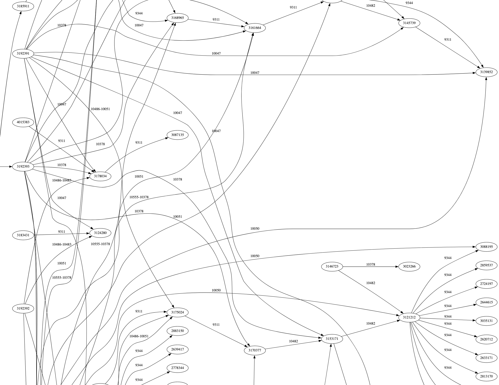
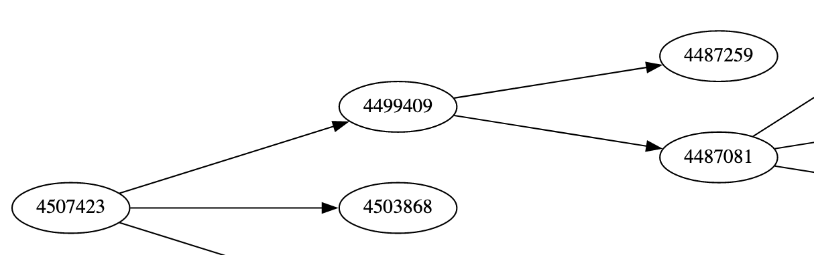
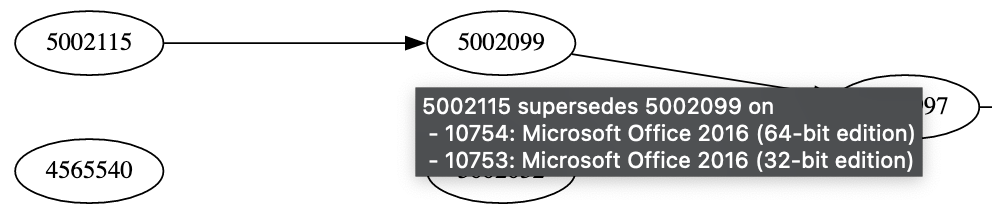
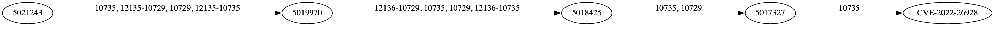
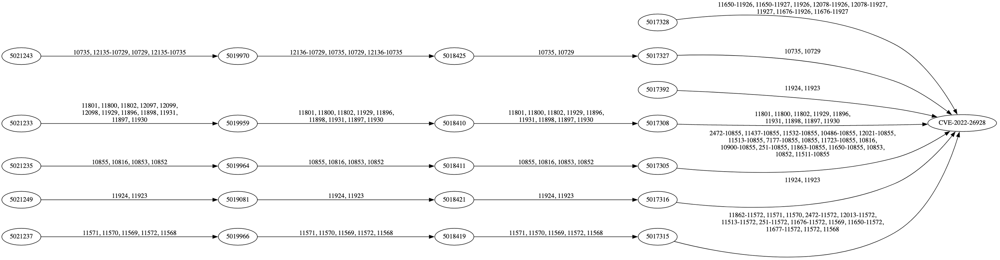
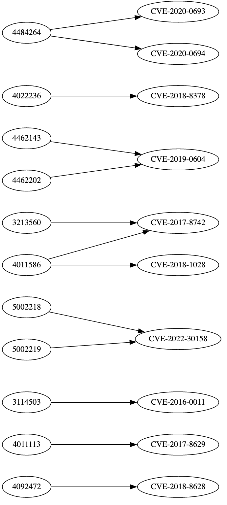

> [Vulnerability Monitoring](../inventory-enrichment-overview.md) > KB research

# KB Research

Understanding the MSRC KB Chain hierarchy data.



One of the more convoluted segments of the node tree

References:

- MSRC Advisors: [Microsoft Update Catalog](https://www.catalog.update.microsoft.com)
- Main MSRC page:
  [Security Update Guide - Microsoft Security Response Center](https://msrc.microsoft.com/update-guide/vulnerability)
- API reference: [Microsoft Security Updates API | MSRC](https://api.msrc.microsoft.com/cvrf/v2.0/swagger/index)
- Article:
  [From KBs to CVEs: Understanding the Relationships Between Windows Security Updates and Vulnerabilities](https://claroty.com/team82/blog/from-kbs-to-cves-understanding-the-relationships-between-windows-security-updates-and-vulnerabilities)

Table of contents:

<!-- TOC -->

* [Definitions & Facts](#definitions--facts)
* [Data Sources](#data-sources)
    * [Sources](#sources)
    * [Problems with the data sources](#problems-with-the-data-sources)
* [Data mirror](#data-mirror)
    * [Getting the data](#getting-the-data)
    * [Data inconsistencies](#data-inconsistencies)
* [Understanding the data](#understanding-the-data)
    * [Supersedence](#supersedence)
    * [What KBs do I need to fix a CVE?](#what-kbs-do-i-need-to-fix-a-cve)
    * [What CVEs are in my product with KBs?](#what-cves-are-in-my-product-with-kbs)
* [Summary](#summary)

<!-- TOC -->

## Definitions & Facts

- The MSRC mirror contains ~6500 MSRC Advisors, which may reference security updates (KB) published by Microsoft
- Security updates are identified by KB-Identifiers, e.g. KB5012118 from
  https://www.catalog.update.microsoft.com/ScopedViewInline.aspx?updateid=39b0464e-f56e-490d-b0fa-bbdde81d1755#PackageDetails
- These entries can each:
    - replace other KB entries by being a cumulative update, e.g.
      ```
      This update replaces the following updates:
      2022-01 Cumulative Update for .NET Framework 4.8 for Windows 10 Version 1607 (KB5008877)
      2022-02 Cumulative Update for .NET Framework 4.8 for Windows 10 Version 1607 (KB5010460)
      ```
      be replaced by others, e.g.
      ```
      This update has been replaced by the following updates.
      2022-05 Cumulative Update for .NET Framework 4.8 for Windows 10 Version 1607 (KB5013625)
      ```
- Superseded identifiers format:
    - Multiple identifiers split by `;`, `,`, `<br><br>`
        - 7-digit identifiers (`4528760`)
        - References to other Microsoft Security Bulletins (`MS16-016`)
        - None
        - A singular entry `50185` with only *5* digits on `MSRC-CVE-2022-41064`, which seems to be an incomplete
          reference to `5018544`
        - A singular entry `982666` with only *6* digits
          ([Microsoft Update Catalog](https://www.catalog.update.microsoft.com/ScopedViewInline.aspx?updateid=3a3177ac-957a-495c-88b8-dc89eb2403bd))
    - They may contain ` ` or `\n` at the beginning/end/in between elements of the list
    - When split by `;`, they reference Microsoft Security Bulletins with KB-Ids in this format: `MSxx-xxx, xxxxxxx`,
      e.g. `MS16-016, 3124280; MS16-097, 3178034;`.
    - Since we do not mirror the MS Bulletins, we can drop the bulletin IDs.
- Every relation between `KB ↔︎ KB` and `KB ↔︎ CVE/ADV` is contained behind a MS product Id meaning it can only be
  used, if the referenced product is used

## Data Sources

### Sources

- [Security Update Guide - Microsoft Security Response Center](https://msrc.microsoft.com/update-guide)
    - can **manually** be downloaded as multiple csv files, one per year. Time frame has to be set manually.
    - contains `CVE/ADV ↔︎ KB` relations that are not present in the other sources.
    - does not contain `KB ↔︎ KB` relations.
    - A short how-to can be found [here](performing-csv-download.md).
- [Microsoft Security Updates API | MSRC](https://api.msrc.microsoft.com/cvrf/v2.0/swagger/index)
    - can **automatically** be mirrored using our process (see below),
    - contains `CVE/ADV ↔︎ KB` relations that are not present in the other sources,
    - contains `KB ↔︎ KB` relations,
    - only contains relations that have a MS Security Update Advisor.
- [Microsoft Update Catalog](https://www.catalog.update.microsoft.com/Home.aspx)
    - **cannot** be mirrored (no API/download available),
    - contains `KB ↔︎ KB` relations,
    - does not contain `KB ↔︎ CVE/ADV` relations.

### Problems with the data sources

- Only one of the three data sources can be retrieved automatically. The one available for mirroring is the most
  important one, yet it still misses a lot of information.
- The data in between the different sources is inconsistent. Every data source either contains `CVE/ADV → KB`
  or `KB → KB`relations that are missing in the other sources. The Update Catalog knows about this information, but is
  inconsistent in itself.  
  An example for `KB4499409`:
    - **In the Update Catalog**:
      [Update Catalog](https://www.catalog.update.microsoft.com/ScopedViewInline.aspx?updateid=1237f59d-2dcf-4be5-ad58-3448a5b99491#PackageDetails)
      `4499409` replaces (`4487259` and `4487081`), but is not replaced by `4507423`. When looking at the
      entry `4507423`,
      it can be seen that it replaces `4499409`.
    - **In the API**: the KB replaces (`4487259` and `4487081`) and is replaced by `4507423`
      
- This means, our data will never be complete unless considering all three data sources, which is impossible to
  automate. it is reasonable to manually download the csv files from the MSRC, but scraping the Update Catalog is not
  feasible, manually or automated.
- The MSRC csv has to be downloaded in time segments of one year, which have to be set manually, which takes quite some
  time

## Data mirror

### Getting the data

1. **Data structure used**  
   The data structure used to store a KB identifier and its dependencies is a node-based graph. A Node has these
   properties:

    - `String kbId`
    - `Map<String, ReferenceEntry> relations` with the product Id as key (or name if not available, which is only the
      case
      on very few entries)

   Where a `ReferenceEntry` contains:

    - `Set<String> affectedVulnerabilities`
    - `Set<Node> supersededBy`
    - `Set<Node> supersedes`
2. **Get KBs from MSRC Security Update Guide**
    - Also see [performing-csv-download.md](performing-csv-download.md).  
      Go to the Security Update Guides
      [Security Update Guide - Microsoft Security Response Center](https://msrc.microsoft.com/update-guide)
      website. Make sure to be in the `All` section.  
      You cannot download all entries at once - only individual lists in a certain time frame (max. one year). Download
      the csv files from as many time-frames as you need.
      This may take quite some time, so consider filtering the data to only the CVE that interest you.
    - For every line in every document you downloaded:
        - If the `Article` is a KB identifier (see criteria above), check if a `Node` with the KB already exists,
          otherwise create a new one (`current`).
          There are two columns named Article, select the first one.
        - Get the product name from `Product` and find the corresponding product id from the `MsrcProductIndexQuery`. If
          not available, use the name.
        - If the `ReferenceEntry` for that product Id does not yet exist, create a new one
        - Add the CVE-identifier from `Details` to `affectedVulnerabilities` to the `ReferenceEntry` with the product
          Id/name of `current`.
    - Store the result
3. **Get KBs from MSRC Api**
    - Download all monthly detail files (see
      [MSRC Download](../mirror/download.md#msrc--advisory-dataproduct-mappings---msrc-))
    - Create index from downloaded files (see [MSRC Index](../mirror/download.md))
    - For every advisor in the data set iterate over all remediations provided
        - Get the supersedence, description and affected product Ids
        - If the description is a KB identifier (see criteria above), check if a `Node` with the KB already exists,
          otherwise create a new one (`current`)
        - Set the `kbId` of `current` to the description
        - For every product Id:
            - If the `ReferenceEntry` for that product Id does not yet exist, create a new one on `current`
            - Get the entry-id and add it to `affectedVulnerabilities` to the `ReferenceEntry`
            - Split the supersedence into multiple KB identifiers (see criteria above) and for every one:
                - Check if a `Node` with the KB already exists, otherwise create a new one (`ref`)
                - Add `ref` to `supersedes` to the `ReferenceEntry`
                - Add `current` to `supersededBy` to the `ReferenceEntry`
    - Store the result
4. **Merging the KB Nodes**
   Make sure to update the references of supersededBy and supersedes to the new merged list. This can be quite tricky to
   get right.  
   Advantages of the data from:
    - MSRC Security Update Guide: Contains a CVE/ADV that would be missing in the Api data
    - MSRC Api: Contains references in between KB Identifiers

<details>
  <summary>Example data for ...</summary>

... a remediation entry in the MSRC API

```json
{
  "description": "5012118",
  "subType": "Security Update",
  "type": "Vendor Fix",
  "url": {
    "title": "5012118",
    "url": "https://catalog.update.microsoft.com/v7/site/Search.aspx?q=KB5012118"
  },
  "fixedBuild": "4.8.4494.03",
  "affectedProductIds": [
    "11650-10816",
    "11650-10852",
    "11650-10853",
    "11650-10855"
  ],
  "supercedence": "5008877"
}
```

... a parsed entry from the MSRC Security Update Guide

```json
{
  "kbId": "5008631",
  "rel": {
    "11908": {
      "vuln": [
        "CVE-2022-21855",
        "CVE-2022-21846",
        "CVE-2022-21969"
      ],
      "supBy": [],
      "sup": []
    },
    "11682": {
      "vuln": [
        "CVE-2022-21855",
        "CVE-2022-21846",
        "CVE-2022-21969"
      ],
      "supBy": [],
      "sup": []
    }
  },
  ...
}
```

... a parsed entry from the MSRC Api

```json
{
  "kbId": "3203467",
  "rel": {
    "10528": {
      "vuln": [
        "CVE-2017-8508",
        "CVE-2017-8507",
        "CVE-2017-8506"
      ],
      "supBy": [
        "2956078"
      ],
      "sup": [
        "3118388"
      ]
    },
    "10527": {
      "vuln": [
        "CVE-2017-8508",
        "CVE-2017-8507",
        "CVE-2017-8506"
      ],
      "supBy": [
        "2956078"
      ],
      "sup": [
        "3118388"
      ]
    }
  }
}
```

</details>

### Data inconsistencies

As already mentioned above, the data sources are inconsistent between each other. Expand the box below to see the
differences in the MSRC Security Update Guide CSV and the MSRC Api.


<details>
  <summary>Differences as of 2023-01-18</summary>

```
File [2016.csv] with [459] entries:
  - new KB nodes: [0]
  - new products relations: [6310]
  - vulnerabilities that caused new relations: [66]
  - new vulnerabilities (not in Api): [0]
File [2017.csv] with [568] entries:
  - new KB nodes: [0]
  - new products relations: [9389]
  - vulnerabilities that caused new relations: [102]
  - new vulnerabilities (not in Api): [0]
File [2018.csv] with [722] entries:
  - new KB nodes: [11]
  - new products relations: [16296]
  - vulnerabilities that caused new relations: [48]
  - new vulnerabilities (not in Api): [1]
File [2019.csv] with [519] entries:
  - new KB nodes: [0]
  - new products relations: [15464]
  - vulnerabilities that caused new relations: [22]
  - new vulnerabilities (not in Api): [0]
File [2020.csv] with [627] entries:
  - new KB nodes: [0]
  - new products relations: [12540]
  - vulnerabilities that caused new relations: [150]
  - new vulnerabilities (not in Api): [0]
File [2021.csv] with [505] entries:
  - new KB nodes: [0]
  - new products relations: [2194]
  - vulnerabilities that caused new relations: [27]
  - new vulnerabilities (not in Api): [0]
File [2022.csv] with [464] entries:
  - new KB nodes: [2]
  - new products relations: [5396]
  - vulnerabilities that caused new relations: [176]
  - new vulnerabilities (not in Api): [0]
File [2023.csv] with [27] entries:
  - new KB nodes: [0]
  - new products relations: [13]
  - vulnerabilities that caused new relations: [0]
  - new vulnerabilities (not in Api): [0]
```

Where

- `new KB nodes` are the KB entries that were not known yet
- `new products relations` are the amount of new product relations on KB entries
- `vulnerabilities that caused new relations` are the unique vulnerabilities that were not present in at least one KB
  relation
- `new vulnerabilities (not in Api)` are the “*real*” new vulnerabilities that were completely absent in the MSRC Api

</details>

Meaning in total, there are:

- **13** new KB
  nodes: `5005112, 5005412, 5016129, 5016987, 5018922, 5014024, 5016990, 5017397, 5017396, 5016263, 4586863, 5001400, 5005260`
- **67.602** new product relations, out of which there are **583** unique products
- **591** vulnerabilities that might have been known to some, but not all
  relations: `CVE-2021-42285, CVE-2019-1080, CVE-2019-1081, CVE-2021-42283, CVE-2021-42284, CVE-2016-7202, CVE-2021-42280, ...`
- **1** vulnerability that was completely unknown to the MSRC Api, which is a MSRC advisory: `ADV990001`
  note that this is not really a vulnerability, but an advisor that contains SSU Package information for different
  Windows versions, which is referenced by almost every monthly API document in the
  notes: [https://msrc.microsoft.com/update-guide/en-us/vulnerability/ADV990001](https://msrc.microsoft.com/update-guide/en-us/vulnerability/ADV990001)

What can we learn from this? The sheer amount of data prevents one from checking every entry, but here are some general
rules:

- We do not miss out on any new vulnerabilities if we do not include the Update Guide CSV data.

- The most important quality of the Update Guide CSV data is, that it contains relations between vulnerabilities and
  fixing KBs that are not present in other sources.  
  The roughly 70.000 relations are all of the form "KB → on product → fixes vulnerability". On several vulnerabilities,
  without this information, we would not know what KB could fix it.

## Understanding the data

If you followed the steps above, you should now have a comprehensive complete dataset of the `KB ↔︎ KB` and
`KB ↔︎ CVE/ADV` relations. There are two main use-cases this data can be used for. But first, let’s explore what
supersedence means in this context.

### Supersedence

In the context of MSRC data, "supersedence" refers to the relationship between KB Ids, whereby if a KB, that supersedes
another KB, is installed on a system, the installed KB will address the vulnerabilities associated with both entries.

To determine all KB Ids that are included in the update with the original KB entry, it is necessary to follow the KB
chain in the direction of the "supersedes" set.  
If a product Id is given: relations can now only be used if the relation includes that product Id.

An example: If you have the update referencing `KB5002115` installed on your system, you will also have the `KB5002099`
installed ([Microsoft Update Catalog](https://www.catalog.update.microsoft.com/ScopedViewInline.aspx?updateid=1ce31df8-5ff8-4633-b9da-54c6e3e78fdd#PackageDetails)).
As seen in the image below, this fix is only available on product `10753` and `10754`, meaning the KB is only superseded
if a product with one of the product Ids is in use. This can obviously be ignored if you do not care for what product
the fix is for.



### What KBs do I need to fix a CVE?

**Input**: a vulnerability (CVE/ADV) and optionally a product Id  
**Output**: KB identifiers

This is a relatively easy task:

- Map the product name(s) to product Id(s) (e.g. using the `MsrcProductIndexQuery`)
- Create two lists to store KB Ids (`Nodes`) in: a target list kbIds for all the KB Ids that fix the vulnerability and
  one`toCheckKbIds` that contains only the ones that still need to be checked for supersedence
- Add all KB Ids that contain the vulnerability in `affectedVulnerabilities` to `kbIds` and their superseded by `Nodes`
  to`toCheckKbIds`; if a product Id is given, use only the relations with the according product Id, otherwise use all
- Until the `toCheckKbIds` are empty:
    - Pop a KB Id off the list
    - Perform step 2, but ignore the requirement that the vulnerability has to be in `affectedVulnerabilities`

<details>
  <summary>Example code</summary>

```java
final Set<MsrcSupersedeNode> kbIds = new HashSet<>(findNodesByVulnerability(vulnerability, productId));
final Set<MsrcSupersedeNode> toCheckKbIds = new HashSet<>();
for (MsrcSupersedeNode node : kbIds) {
    toCheckKbIds.addAll(findNodesBySupersedesKbId(node.getKbId(), productId));
}

while (!toCheckKbIds.isEmpty()) {
    final MsrcSupersedeNode node = toCheckKbIds.iterator().next();
    toCheckKbIds.remove(node);

    kbIds.add(node);
    toCheckKbIds.addAll(findNodesBySupersedesKbId(node.getKbId(), productId));
}

return kbIds;
```

</details>

An example: You want to check for the vulnerability `CVE-2022-26928` and the product `Windows 10 for x64-based Systems`.

1. `Windows 10 for x64-based Systems` has the Id `10735`
2. The vulnerability CVE-2022-26928 is contained in the KB
   identifiers `5017328, 5017327, 5017392, 5017308, 5017305, 5017316, 5017315`, but only `5017327` fixes the product
   Id `10735`
3. Find additional KB Ids for the already found ones by following the supersedes chain: `5018425` supersedes `5017327`
   with product Id `10735`
4. Continue: `5018425` is superseded by `5019970` is superseded by `5021243` each with product `10735`
5. No more new KBs

→ the `CVE-2022-26928` on `Windows 10 for x64-based Systems` is fixed by any of `5017327, 5018425, 5019970, 5021243`:



This chart contains all the KBs, no matter what product Id, to give more context:



### What CVEs are in my product with KBs?

**Input**: a product Id and optionally KB identifiers  
**Output**: CVE/ADV

This task requires a few more steps. Follow these steps to determine the vulnerabilities associated with a given product
Id:

1. Identify all nodes that reference the product Id
2. Collect all vulnerabilities associated with these nodes, but only from the relationships that involve the product Id
3. For each vulnerability, use the previously described algorithm to determine the KB Ids that can fix it
4. Iterate over all vulnerabilities and determine if the list of fixed KB Ids obtained in step 3 includes any of the KB
   Ids provided as a parameter. If so, add the vulnerability to a list of fixed vulnerabilities.
5. Remove all fixed vulnerabilities from the overall list of vulnerabilities

<details>
  <summary>Example code</summary>

```java
final Set<String> vulnerabilities = new HashSet<>();

for (MsrcSupersedeNode node : findNodesByProductId(productId)) {
    vulnerabilities.addAll(node.getProductRelationsByProduct(productId).getAffectsVulnerabilities());
}

final Map<String, Set<String>> vulnerabilitiesFixedByKb = new HashMap<>();
for (String vulnerability : vulnerabilities) {
    final Set<MsrcSupersedeNode> fixingKbIds = findFixingKbIds(vulnerability, productId);
    for (MsrcSupersedeNode fixingKbId : fixingKbIds) {
        vulnerabilitiesFixedByKb.computeIfAbsent(vulnerability, k -> new HashSet<>()).add(fixingKbId.getKbId());
    }
}

final Set<String> fixedVulnerabilities = new HashSet<>();
for (Map.Entry<String, Set<String>> entry : vulnerabilitiesFixedByKb.entrySet()) {
    if (kbIds.stream().anyMatch(fixedKb -> entry.getValue().contains(fixedKb))) {
        fixedVulnerabilities.add(entry.getKey());
    }
}

final List<String> remainingVulnerabilities = new ArrayList<>(vulnerabilities);
remainingVulnerabilities.removeAll(fixedVulnerabilities);

return remainingVulnerabilities;
```

</details>

The resulting vulnerability list of this process tends to grow pretty fast, so I will only make a small example here:

To determine the vulnerabilities present in `Microsoft SharePoint Server 2013 Service Pack 1` with product Id `10607`,
knowing that `KB3172445` is installed on the system, the following steps should be taken:

1. Identify all KB entries with product
   Id: `3039736, 5002218, 4092472, 3213560, 3172445, 3203387, 4018391, 3054862, 4462202, 4022236, 4011586, 4011113, 5002203, 4018392, 3114503, 4484264, 4462139, 4484157, 4461596, 5002219, 4462143`
2. Identify all vulnerabilities associated with the relationships of the product
   Id: `CVE-2018-8628, CVE-2017-8629, CVE-2016-0011, CVE-2016-3360, CVE-2022-30158, CVE-2017-8742, CVE-2017-8511, CVE-2016-3357, CVE-2017-8512, CVE-2019-0604, CVE-2018-8378, CVE-2020-0693, CVE-2020-0694, CVE-2018-1028`
3. Determine the KB IDs that can fix these vulnerabilities. (too big of a list, I will not list them here)
4. Compare the KB Ids passed as parameters to the list of fixing KB Ids to determine which vulnerabilities have been
   fixed by the supersedence chains: `CVE-2017-8511, CVE-2016-3357, CVE-2017-8512, CVE-2016-3360`
5. Remove the fixed vulnerabilities from the list, resulting in the final
   vulnerabilities: `CVE-2018-8628, CVE-2017-8629, CVE-2016-0011, CVE-2022-30158, CVE-2017-8742, CVE-2019-0604, CVE-2018-8378, CVE-2020-0693, CVE-2020-0694, CVE-2018-1028`

This means these vulnerabilities are still in the system and can be fixed by applying the listed KB Ids:



## Summary

It is important to note that while Microsoft does offer various methods for accessing their public data, it can be
challenging to create a complete and accurate knowledge base mirror due to inconsistencies between data sources and
difficulty accessing some of the sources. Additionally, understanding the connections and the concept of supersedence in
this context is not a straightforward task. However, as demonstrated, a dataset of this nature can provide the
foundation for a variety of useful applications.
